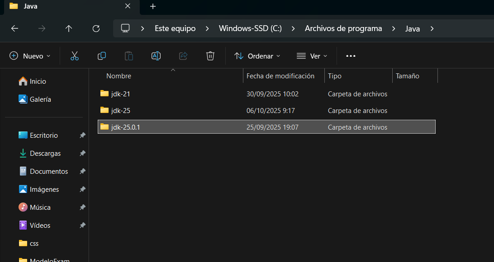
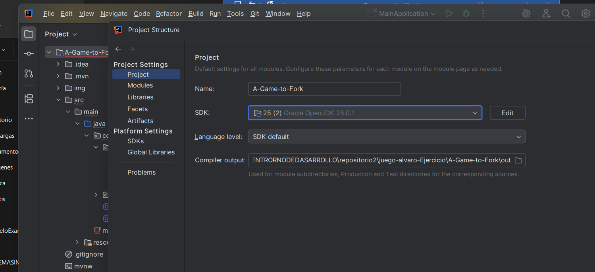
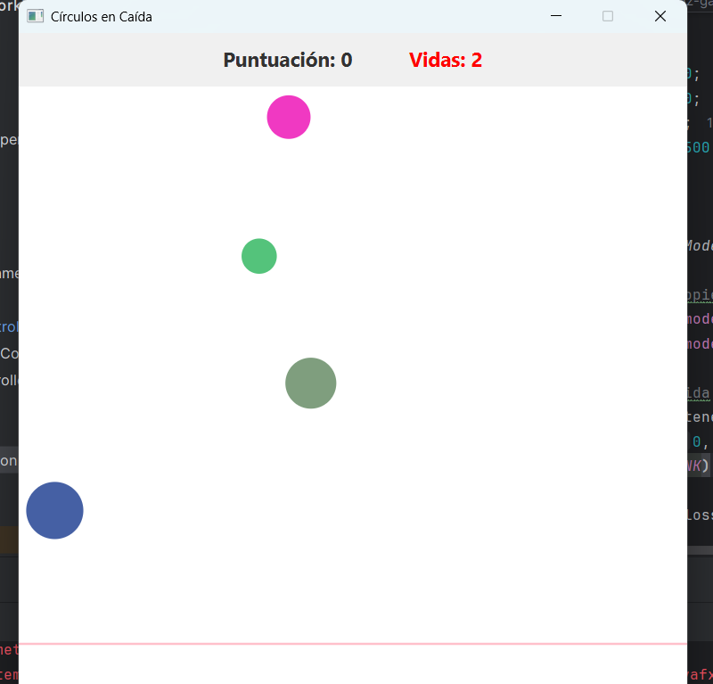
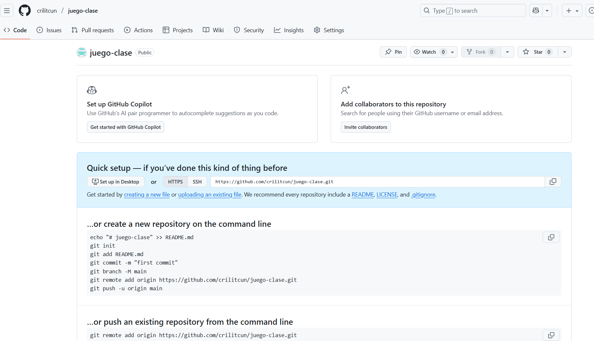
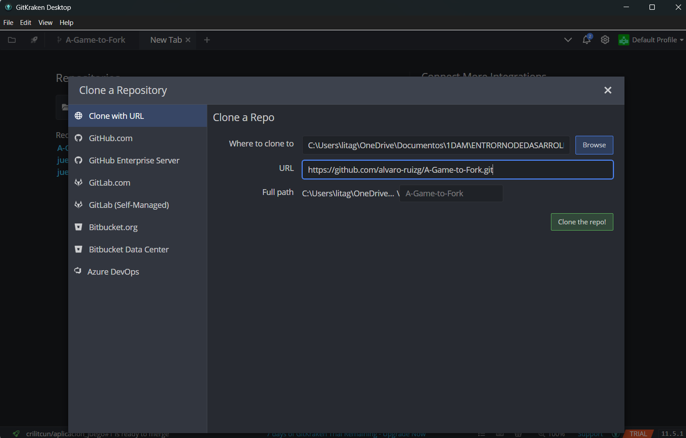
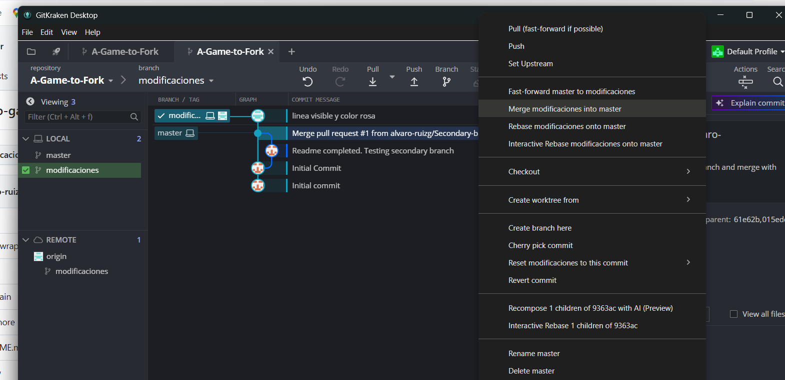

# Mejora del juego original

## Funcionalidades añadidas
Estas son las mejoras que he implementado en el juego:

- Visible linea donde desaparecen los círculos y cambio de color a pink.

## Proceso de bifurcación y desarrollo

### 1. Creación del repositorio vacío
- Creé un repositorio vacío en mi cuenta de GitHub:  
  `https://github.com/crilitcun/juego-gameover.git`

### 2. Clonación del repositorio del profesor
- Usé GitKraken para clonar el repositorio original del profesor.

### 3. Configuración del remoto
- Añadí mi repositorio como nuevo remoto (`myorigin`) en GitKraken.

### 4. Creación de rama secundaria
- Creé una nueva rama llamada `mejoras` desde la interfaz de GitKraken.

### 5. Desarrollo de mejoras, Modifica el repositorio clonado del profe en tu PC
- Abre IntelliJ IDEA 2025.
- En el menú, selecciona "Abrir proyecto existente".
- Introduce la ruta local del repositorio que clonaste.

  
  
  
  
  
  

private final double LOST_LINE_Y = 500; 

1. La línea se dibuja antes de que PANE el  tenga tamaño
Line lossLine = new Line(0, LOST_LINE_Y, gamePane.getWidth(), LOST_LINE_Y);

  gamePane.getWidth() puede devolver 0  si el PANE aún no ha sido renderizado. Esto haría que la línea tenga longitud cero y no se vea.
. Usa gamePane.widthProperty() para escuchar cuando el  PANE tenga tamaño:

gamePane.widthProperty().addListener((obs, oldVal, newVal) -> {
    Line lossLine = new Line(0, LOST_LINE_Y, newVal.doubleValue(), LOST_LINE_Y);
    lossLine.setStroke(Color.RED);
    lossLine.setStrokeWidth(2);
    gamePane.getChildren().add(lossLine);
});

### 6. Commit y push
- Hice commit de los cambios y los subí a la rama `mejoras` en mi repositorio.

### 7. Fusión con la rama principal
- Fusioné la rama `mejoras` con `main` desde GitKraken.

## Capturas del proceso

Las imágenes están en la carpeta `img`. Aquí se muestran algunas:

### Creación del repositorio vacío

### Clonación del repositorio
  

### Cambio rutas remotas
 

### Creación de rama secundaria

### Fusión con main

